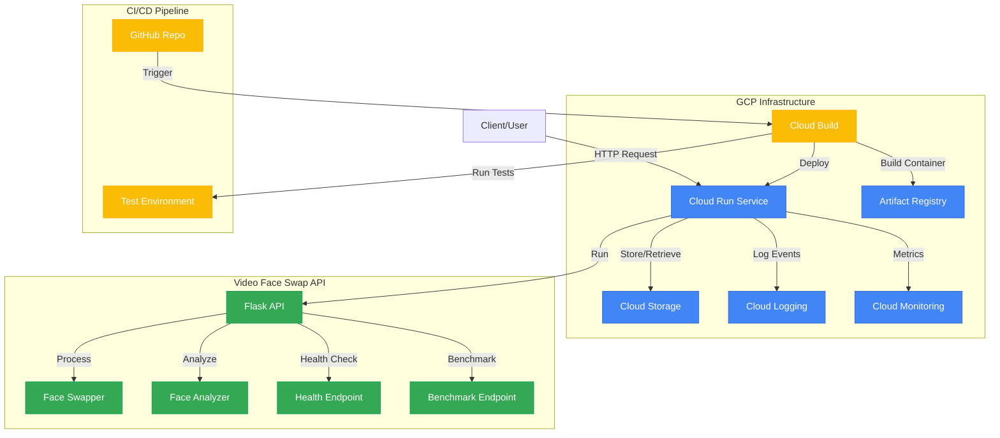

# Video Face Swap API - GCP Cloud Run Solution

This repository contains a production-ready implementation of a Video Face Swap API, built for Google Cloud Platform using Cloud Run, Artifact Registry, and Cloud Storage.

## Credits and Attribution

This project is built upon the foundation of the [video-face-swap](https://huggingface.co/spaces/ALSv/video-face-swap) model available on Huggingface, created by user ALSv. The core face-swapping technology is based on the [roop](https://github.com/s0md3v/roop) project, which provides the underlying algorithms for face detection, analysis, and swapping. We've adapted this technology to work as a scalable, production-ready service on Google Cloud Platform.

## Architecture



The application is built with the following GCP components:

- **Containerization**: Docker images stored in Artifact Registry
- **Compute**: Cloud Run for serverless container deployment
- **API**: Flask-based REST API for face swapping functionality
- **Storage**: Cloud Storage for temporary files and result storage
- **CI/CD**: Cloud Build for automated build, test, and deploy
- **IaC**: Terraform for infrastructure as code
- **Monitoring**: Cloud Monitoring dashboards and alerts
- **Logging**: Cloud Logging for centralized log management

## Features

- **Face Swapping**: High-quality face replacement in images and videos
- **Cloud Storage Integration**: Option to upload results to GCS
- **Horizontal Scaling**: Auto-scales based on demand
- **Health Monitoring**: Comprehensive health checks and benchmarking
- **Security**: Container vulnerability scanning and secure defaults

## Infrastructure as Code

All infrastructure is defined as code using Terraform in the `terraform/` directory:
- `main.tf`: Main Terraform configuration for all resources
- `variables.tf`: Variable definitions for customization
- `terraform.tfvars`: Variable values for your environment

## Getting Started

### Prerequisites

- Google Cloud account with billing enabled
- GCP project with required APIs enabled
- Local development:
  - Docker
  - Python 3.10+
  - Terraform 1.5+
  - gcloud CLI

### Local Development

1. **Clone the repository**:
   ```bash
   git clone <repository-url>
   cd video-face-swap
   ```

2. **Build the Docker image**:
   ```bash
   docker build -t video-face-swap-api:dev -f Dockerfile.optimized .
   ```

3. **Run the container locally**:
   ```bash
   docker run -p 8080:8080 video-face-swap-api:dev
   ```

4. **Test the API**:
   ```bash
   curl http://localhost:8080/health
   ```

### Deployment to GCP

#### Option 1: Manual Deployment

1. **Authenticate with Google Cloud**:
   ```bash
   gcloud auth login
   gcloud config set project YOUR_PROJECT_ID
   ```

2. **Configure Docker to use Artifact Registry**:
   ```bash
   gcloud auth configure-docker us-central1-docker.pkg.dev
   ```

3. **Build and push the Docker image**:
   ```bash
   docker build -t us-central1-docker.pkg.dev/YOUR_PROJECT_ID/video-face-swap/api:latest -f Dockerfile.optimized .
   docker push us-central1-docker.pkg.dev/YOUR_PROJECT_ID/video-face-swap/api:latest
   ```

4. **Deploy with Terraform**:
   ```bash
   cd terraform
   terraform init
   terraform apply -var "project_id=YOUR_PROJECT_ID" -var "container_image_url=us-central1-docker.pkg.dev/YOUR_PROJECT_ID/video-face-swap/api:latest"
   ```

#### Option 2: CI/CD Deployment

1. **Set up a trigger in Cloud Build** to watch your repository

2. **Configure the required substitution variables** in the Cloud Build trigger:
   - `_REGION`: Your preferred GCP region (e.g., us-central1)

3. **Push changes to your repository** to trigger the CI/CD pipeline

## API Usage

### Endpoints

- **GET /health**: Check API health
- **GET /benchmark**: Run performance benchmark
- **GET /model-info**: Get information about loaded models
- **POST /swap**: Perform face swapping

### Face Swap Request

```bash
curl -X POST http://YOUR_SERVICE_URL/swap \
  -F "source=@path/to/source_face.jpg" \
  -F "target=@path/to/target_image_or_video.jpg" \
  -F "output_format=mp4" \
  -F "keep_fps=true" \
  -F "many_faces=false" \
  -F "use_cloud_storage=true"
```

### Response

The API will return either:

1. A direct file download (if `use_cloud_storage=false`), or
2. A JSON response with a public Cloud Storage URL:
   ```json
   {
     "status": "success",
     "request_id": "12345-uuid",
     "url": "https://storage.googleapis.com/bucket/path/to/result.mp4",
     "processing_time": 12.34
   }
   ```

## Performance Optimization

This implementation includes several optimizations for GCP:

1. **Container Optimization**:
   - Multi-stage build for minimal image size
   - Git LFS optimization to exclude large model files from image
   - Layer caching for faster builds
   - Selective model downloading using Git LFS

2. **Cloud Run Configuration**:
   - CPU/memory limits tuned for workload
   - Instance concurrency optimization
   - Enhanced startup/liveness probes
   - Minimum instances for reduced cold starts
   - CPU throttling disabled during startup

3. **Storage Efficiency**:
   - Cloud Storage for temporary files
   - Lifecycle rules for automatic cleanup
   - Optimized file handling

### Git LFS Optimization

This repository uses Git LFS for large model files. For faster clones and builds:

```bash
# Clone with Git LFS optimization (no large files downloaded initially)
GIT_LFS_SKIP_SMUDGE=1 git clone <repository-url>
cd video-face-swap

# Selectively download only needed model files
./scripts/optimize-git-lfs.sh

# Or pull specific models manually
git lfs pull --include="models/inswapper_128.onnx"
git lfs pull --include="models/detection_Resnet50_Final.pth"
```

For CI/CD pipelines, our optimized cloudbuild.yaml implements this pattern automatically.

## Monitoring and Observability

The deployment includes:

- **Custom Dashboard**: CPU, memory, request latency, and error rates
- **Alert Policies**: Notifications for high error rates or excessive latency
- **Structured Logging**: Request details, processing times, and error traces
- **Health Checks**: Comprehensive health and benchmark endpoints

## Testing

The project uses pytest for testing with a structured approach:

```
tests/
├── unit/           # Unit tests for isolated components
├── integration/    # Integration tests for combined functionality
└── performance/    # Performance and load tests
```

### Running Tests

Use the test runner script for convenience:

```bash
# Run all tests
./scripts/run_tests.sh

# Run only unit tests
./scripts/run_tests.sh --unit

# Run with coverage report
./scripts/run_tests.sh --coverage

# For CI environments 
./scripts/run_tests.sh --ci
```

Or use pytest directly:

```bash
# Run all tests
pytest tests/

# Run specific test categories
pytest tests/unit/
pytest tests/integration/
pytest tests/performance/

# Run with coverage
pytest --cov=api tests/
```

### Test Categories

- **Unit Tests**: Fast, isolated tests for individual components
- **Integration Tests**: Tests for combined components and endpoints
- **Performance Tests**: Measure response times and resource usage

### Pre-commit Hook

To enable the pre-commit hook that runs unit tests before each commit:

```bash
ln -sf ../../scripts/git-hooks/pre-commit .git/hooks/pre-commit
chmod +x .git/hooks/pre-commit
```

## Security Features

- **Container Scanning**: Automatic vulnerability scanning
- **Non-root User**: Container runs as non-privileged user
- **Secret Management**: Support for Secret Manager integration
- **Minimal Permissions**: Service account with least privilege

## Cost Optimization

- **Serverless**: Pay only for what you use
- **Auto-scaling**: Scale to zero when not in use
- **Concurrency**: Process multiple requests per instance
- **Caching**: Pre-downloaded models reduce startup costs

## License

This project is licensed under the MIT License - see the LICENSE file for details.

The core face-swapping functionality is based on:
- [video-face-swap](https://huggingface.co/spaces/ALSv/video-face-swap) by ALSv on Huggingface
- [roop](https://github.com/s0md3v/roop) project

Please refer to these original projects for their respective licenses and terms of use.

## Contributing

Contributions are welcome! Please feel free to submit a Pull Request.

1. Fork the repository
2. Create your feature branch (`git checkout -b feature/amazing-feature`)
3. Commit your changes (`git commit -m 'Add some amazing feature'`)
4. Push to the branch (`git push origin feature/amazing-feature`)
5. Open a Pull Request

Please ensure your code follows the project's coding style and includes appropriate tests.

## Project Status

This project is actively maintained and in production use. Future enhancements planned include:

- Advanced face detection and tracking capabilities
- Support for batch processing of multiple videos
- Enhanced privacy features and content moderation
- Performance optimizations for longer videos
- Integration with Vertex AI for more advanced AI capabilities
